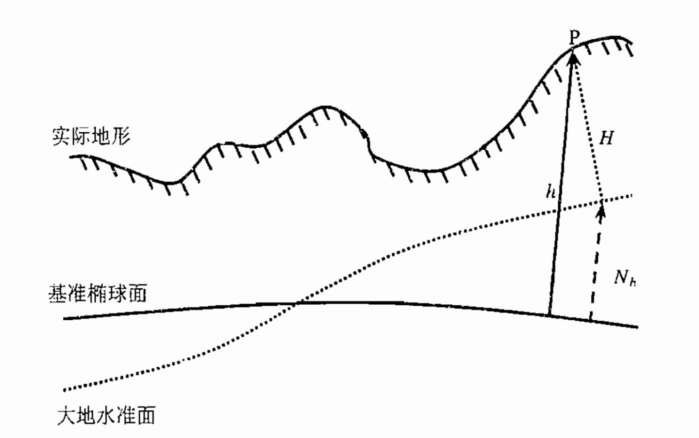
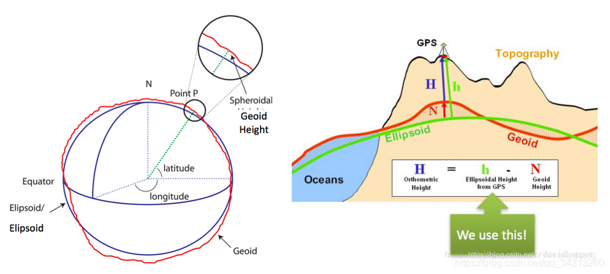
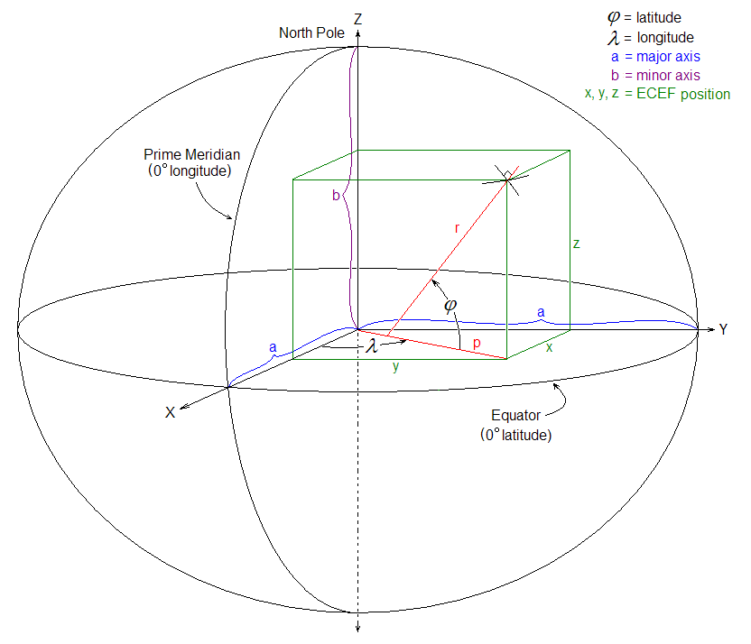
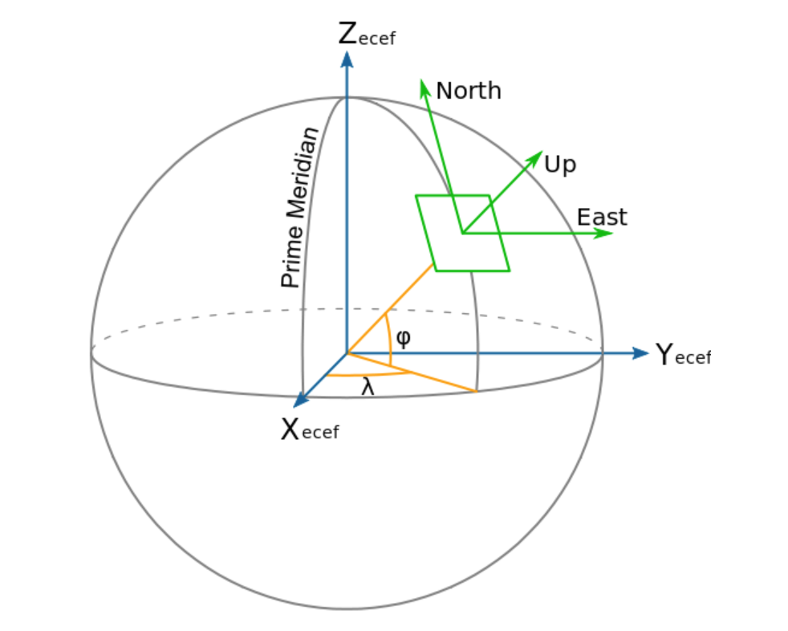

# 预备知识

## 高程与海拔
GPS测量信息：大地经度、大地纬度、大地高程。(图2)  
- 大地经度：过用户点P的基准椭球面法线与本初子午线的夹角。
- 大地纬度：过用户点P的基准椭球面法线与赤道面之间的夹角。
- 大地高度$h$：过用户点P到基准椭球面的法线距离。

基准椭球面：与地球较吻合的椭球面。  
大地水准面：理想海平面、平均海平面。    
高程$h$：距离基准椭球面的高度；  
海拔$H$：距离大地水准面的高度。 

  
  

# 地心地固（ECEF, earth-centered earth-fixed ）坐标系
- 原点：地球质心；  
- x轴：本初子午线(0度精度与地球赤道交点)
- z轴：协议地球北极（地球旋转轴）
- y轴：根据右手直角坐标系判断，穿过赤道和90度经度交点。
  

ECEF下的坐标表示：经纬高(longitude, latitude, altitude)($\lambda ,\phi, h$)，xyz等。  
坐标转换关系：  
- 经纬高转xyz
$$
\begin{array}{l}
x=(N+h) \cos (latitude) \cdot \cos (longitude) \\
y=(N+h) \cos (latitude) \cdot \sin (longitude) \\
z=\left[N\left(1-e^{2}\right)+h\right] \sin (latitude)
\end{array}
$$  
<!-- $$
\begin{array}{l}
x=(N+h) \cos \phi \cdot \cos \lambda \\
y=(N+h) \cos \phi \cdot \sin \lambda \\
z=\left[N\left(1-e^{2}\right)+h\right] \sin \phi
\end{array}
$$   -->
其中，N为基准椭球体的曲率半径，$h$为高程，通过GPS获得。$e,a,b$为椭球偏心率，长半径，短半径。  
$$
e^2=\frac{a^2-b^2}{a^2}
$$  
- xyz转经纬高
<!-- $$
\begin{aligned}
\lambda &=\arctan \left(\frac{y}{x}\right) \\
h &=\frac{p}{\cos \phi}-N \\
\phi &=\arctan \left[\frac{z}{p}\left(1-e^{2} \frac{N}{N+h}\right)^{-1}\right] \\
p &=\sqrt{x^{2}+y^{2}}
\end{aligned}
$$   -->
$$
% \begin{aligned}
longitude =\arctan \left(\frac{y}{x}\right) \\
h =\frac{p}{\cos (latitude)}-N \\
latitude =\arctan \left[\frac{z}{p}\left(1-e^{2} \frac{N}{N+h}\right)^{-1}\right] \\
p =\sqrt{x^{2}+y^{2}}
$$  

# WGS-84坐标系

GPS使用的一种ECEF坐标系。  

# 站心坐标系（东北天ENU坐标系）
如图4，以用户点（球面base点）为坐标中心，指向东北天。y轴指向地理北极，x轴指向东向，z轴指向椭球基准面法线。  

  

ECEF转ENU坐标系：  
ECEF先绕z轴旋转$\lambda+90$度，再绕旋转后的x轴旋转$90-\phi$度得到ENU坐标系。  
- ECEF与ENU坐标系下的空间点转换：  
$$

\left[\begin{array}{l}
e \\
n \\
u
\end{array}\right]=S \cdot\left[\begin{array}{l}
x \\
y \\
z
\end{array}\right]} \\ \\
{\left[\begin{array}{l}
x \\
y \\
z
\end{array}\right]=S^{-1} \cdot\left[\begin{array}{l}
e \\
n \\
u
\end{array}\right]} \\ \\
% S=\left[\begin{array}{ccc}
% -\sin \lambda & \cos \lambda & 0 \\
% -\sin \phi \cos \lambda & -\sin \phi \sin \lambda & \cos \phi \\
% \cos \phi \cos \lambda & \cos \phi \sin \lambda & \sin \phi
% \end{array}\right] \\ \\

S=\left[\begin{array}{ccc}
-\sin (longitude) & \cos (longitude) & 0 \\
-\sin (latitude) \cos (longitude) & -\sin (latitude) \sin (longitude) & \cos (latitude) \\
\cos (latitude) \cos (longitude) & \cos (latitude) \sin (longitude) & \sin (latitude)
\end{array}\right]
$$  

- ECEF坐标系$(R,t)$与ENU坐标系$(R',t')$下的pose转换
$$ R' = S*R, t'=S*t$$  
- 自己的理解：按照上述方式转换后的每个时刻的ENU坐标是在该时刻ENU坐标系下的，为了统一坐标系，将除第一帧外的ENU坐标都转到第一帧(或某个base点)的ENU坐标系下： 

假设已知base点的llt坐标，转为ECEF下的坐标$(x_0,y_0,z_0)$，某时刻下的ECEF坐标为(x,y,z)，则在ECEF下的平移向量为：  
$[x-x_0,y-y_0,z-z_0]$  
该时刻点在base点ENU坐标系下的坐标为：
$$
t^{\prime}=\left[\begin{array}{l}
x^{\prime} \\
y^{\prime} \\
z^{\prime}
\end{array}\right]=S \cdot\left[\begin{array}{l}
x-x_{0} \\
y-y_{0} \\
z-z_{0}
\end{array}\right]
$$  

# Reference
[高精地图的地理坐标系——zhihu][1]  
[GPS经纬度坐标WGS84到东北天坐标系ENU的转换][2]  
[Transformations between ECEF and ENU coordinates][3]

[1]:https://zhuanlan.zhihu.com/p/354848170
[2]:https://blog.csdn.net/qq_42422098/article/details/120265593
[3]:https://gssc.esa.int/navipedia/index.php/Transformations_between_ECEF_and_ENU_coordinates
